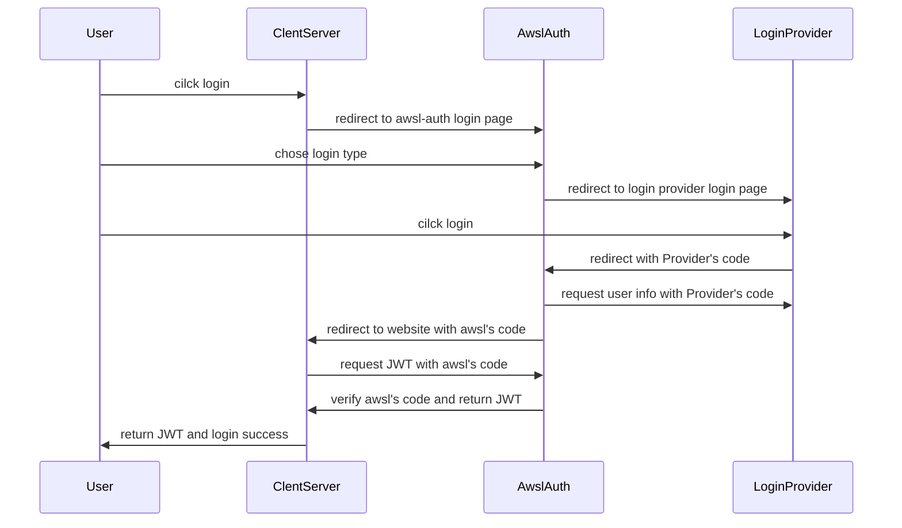

# Awsl Auth

```mermaid
sequenceDiagram
    User->>ClentServer: cilck login
    ClentServer->>AwslAuth: redirect to awsl-auth login page
    User->>AwslAuth: chose login type
    AwslAuth->>LoginProvider: redirect to login provider login page
    User->>LoginProvider: cilck login
    LoginProvider->>AwslAuth: redirect with Provider's code
    AwslAuth ->> LoginProvider: request user info with Provider's code
    AwslAuth->>ClentServer: redirect to website with awsl's code
    ClentServer->>AwslAuth: request JWT with awsl's code
    AwslAuth->>ClentServer: verify awsl's code and return JWT
    ClentServer->>User: return JWT and login success
```
