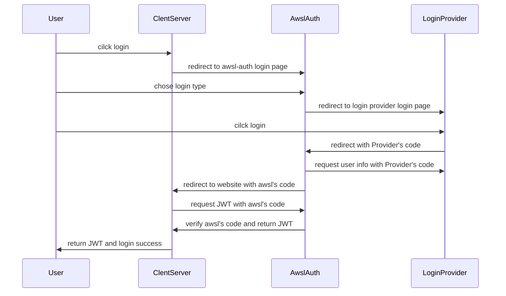

# Awsl Auth



## Usage

config `app_id` `app_secret` `redirect_url` in `.env` or ENV.

1. redirect to `https://auth.awsl.icu/login?app_id=demo`

2. after login, will redirect to `<yourwebsiteredirect_url>?code=<awsl's code>`

3. request JWT with `POST` to `https://auth.awsl.icu/api/token` with `code`, `app_id` and `app_secret` in body

    ```js
    const { jwt } = await api.fetch("/api/token", {
        method: "POST",
        message: message,
        body: JSON.stringify({
            app_id: "demo",
            app_secret: "demo_secret",
            code: code,
        })
    });
    ```

4. choose one of the following ways to use `jwt`
   1. just use the `jwt` in your browser and decode by `app_secret`

   2. or request with `jwt` to get user info

    ```js
     user = await api.fetch(`/api/info?app_id=${app_id}`, {
            message: message,
            headers: {
                'Authorization': `Bearer ${jwtSession.value}`,
                'Content-Type': 'application/json',
            }
        });
     ```
